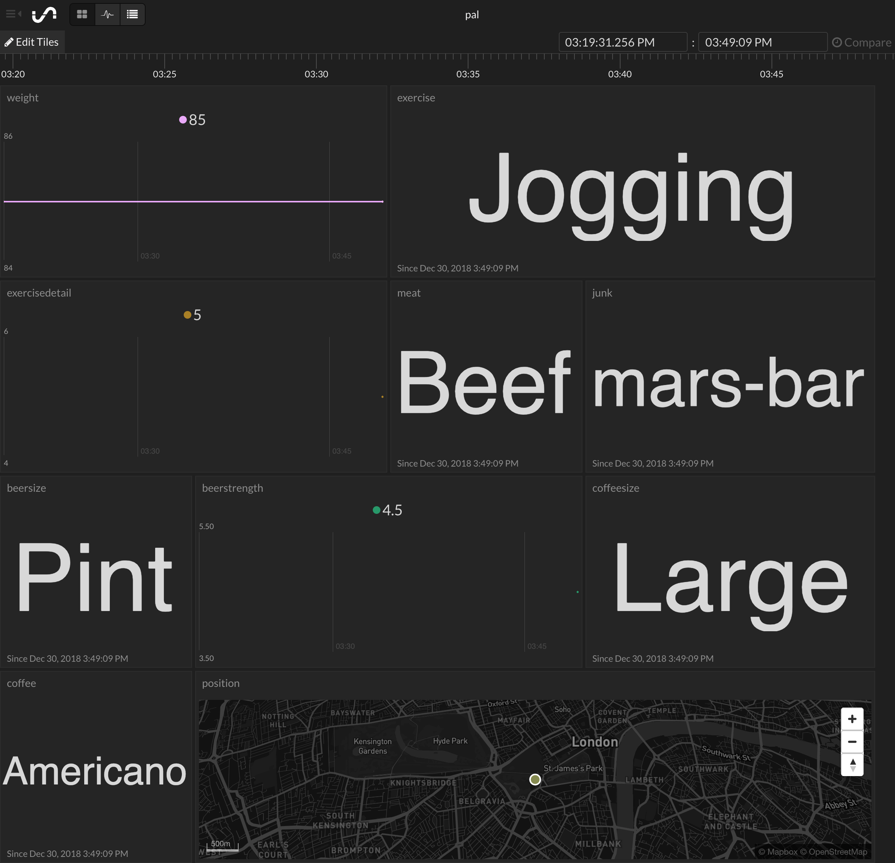

## Personal Activity Logger

With the New Year comes new ambitions to eat less, drink less, and do more!

To help us see ~~whether~~ how we're succeeding it will be helpful to visualise our progress.

So, we're going to need to create:

1. A way of recording when any relevant actions take place, along with any extra details we might want later.
2. A nice dashboard to view and analyse the progression of the recorded information over time.

The plan:

1. Create an online form which can capture the actions and info we want to record and be accessed at any time.
2. Create a dashboard which can receive the form data and display it in useful and interesting ways.

Tools of the trade:
1. Codepen - or your favourite code editor
2. Initial State - obviously no choice on this one :smiley:
3. Netlify - or any other web host if you want your form online

### Part 1: Create the form

Here's an example on [Codepen](https://codepen.io/intp8/pen/dwJbaR) - copy and modify however you like, or create your own from scratch.


- This is the selection of things we've decided to log for now; we can easily add more later if we want.
- There's also a bit of Javascript to provide the ability to log my location from the device if desired.
- We'll be able to fill in as few or as many of the values as we want to for each submission.

#### Who - What - When - Where - Why?

Whatever you want to record, hopefully this gives you a starting point for creating your form.

The Initial State dashboard will automatically handle the 'When' based on the time of submission, and can put the 'Where' on a map if you provide co-ordinates, such as produced by the Javascript code in the example. The rest is up to you!

[Here's some help for changing or creating a form](https://www.w3schools.com/html/html_form_elements.asp)

For anyone using CodePen, before moving on it's worth checking that the form submission is working ok. Assuming there is nothing yet between the "" in the <form action="" tag, after clicking on the 'Submit' button you should see something like this :


Possible fixes if things don't look right:

- Ensure all inputs have an 'name' attribute (without one, no data will be sent for that input and it won't appear in the left column above)
- Ensure that <option value="" is used if you want the first value in a 'select' input to act as a placeholder only and not be submitted
***

### Part 2: Create the dashboard

Head over to [Initial State](https://www.initialstate.com/), sign in (or sign up!) and create a new Stream Bucket via the  icon:


Give it a name and copy the 'Endpoint URL':


Go back to the code for your form and replace the URL in the "<form action..." tag with the copied URL:

```
<form action="https://groker.init.st/api/events?accessKey=g0bbl3d3g00k&bucketKey=s0m3j4zz" method="POST">
```
#### The moment of magic

Now we should be all set to send our first entry to the dashboard!

In order to design the dashboard, try sending an entry for all of the different inputs you intend to use.

- We can easily remove inputs from the dashboard later.
- We can remove 'fake data' from the dashboard later.

You should now see something like this on your dashboard:



- There should be a tile for each field, with the name specified in the 'name' attribute of the input tag in the form HTML at the top
- The type of tile should be appropriate for the type of value sent to it (for example, the location co-ordinates have resulted in a map)

#### Customise the tile layout
We can now have a play around with the look and feel of the dashboard via the 'Edit Tiles' button at the top-left of the dashboard.

There's a lot of possibilities, as documented [here](https://support.initialstate.com/hc/en-us/articles/360002665692-Introduction-to-Tiles). Don't forget to have a look at your layout on any other devices you'll be using it on!

We no longer need the initial test data we sent to the dashboard, so it would be nice to get rid of it. Here's the steps:
- Create a new Stream Bucket as before
- Click on 'Import View' and select the original bucket


Et voila, you should now see a tile layout which is the same as the one you just created, but with no values in it.


Finally, we just need to copy the 'Endpoint URL' for the new bucket and replace the URL in the <form action"... tag, just as we did previously.

Next time you submit values from your form, they should appear in the new dashboard.

### Part 3: Put a view of the dashboard with the form and make available online

We may like to be able to see the dashboard right after we've made an entry - so let's use the 'Share by Embed' feature to add a view onto it below our form.


For anyone using the example form code, copying the <iframe src... snippet and putting at the bottom of the HTML in between some extra <div> tags per below may be suitable. You may also want to add some size attributes to the iframe tag.

```
<div class="container">
<iframe width="370" height="840"
src="https://iot.app.initialstate.com/embed/?org=iot#/tiles/gobbledegook">
</iframe>
</div>
```

#### Publish the form and dashboard online

For this site we could to use [Netlify](https://www.netlify.com/)- it's free and easy to get a simple site up and running in no time.

The page can be downloaded from Codepen using the 'Export' link at the bottom right to get a zip folder containing the HTML, CSS and JS files required.


Next, login to Netlfiy and simply drag the unzipped folder into the area marked as below:  


We now have our form and dashboard available online! [Bitly](https://bitly.com/) is an option if you'd prefer a shorter link to it.

#### Keeping things to ourselves

Perhaps you'd prefer to keep beady eyes and hands away from your page - one simple way to add some password protection to your page is to use this [Staticrypt](https://robinmoisson.github.io/staticrypt/) facility; follow the 'How it works' (and note the Disclaimer!), encrpyt the HTML from your index.html and download the file.

Rename this file to 'index.html' again, overwrite the original file in the unzipped folder from CodePen, and upload again to your site on Netlify via the 'Deploys' page.


You should now be presented with a login box next time you visit the site.


If you've used CodePen you may also want to delete the API details, or make it Private if you have a paid account.

### Wrap-up

Hopefully this guide has provided a useful starting point and sparked some ideas for collecting data from a web form and displaying it on an Initial State dashboard! And don't forget the there's also the wonderful worlds of the Waves section of the dashboard and the power of Expressions to explore.

Happy New Year and best of luck with your resolutions!  
